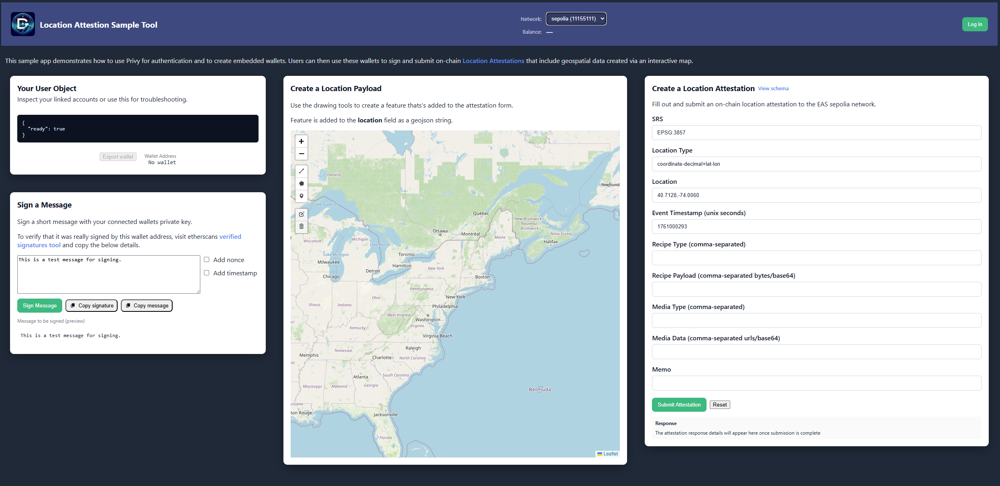

# Privy-EAS Integration Demo

A demo application showcasing how to use Privy for authentication and embedded wallets to sign and submit on-chain location attestations to the Ethereum Attestation Service (EAS).

<p align="center">
  
</p>

## Getting Started

Before installing and running the app, ensure you have create a Privy application in the [Privy Dashboard](https://dashboard.privy.io/) and obtain your App ID and App Secret. Follow the steps in [docs/privy-app-configuration.md](./docs/privy-app-configuration.md) to set up your app.

```bash
npm install
npm run dev
```

Open `http://localhost:5173` to view the app.

## Environment Configuration

### Client-side Variables (VITE_* prefix)

These variables are exposed to the browser and should contain **non-sensitive** public identifiers only.

Create `.env.vite` or `.env.local` in the project root:

```env
VITE_PRIVY_APP_ID=<your_privy_app_id>
```

Get your Privy App ID from the [Privy Dashboard](https://dashboard.privy.io/)

### Server-side Variables (No VITE_ prefix)

If you have a backend server, add these to `.env` (NOT `.env.vite` or `.env.local`):

```env
PRIVY_APP_ID=<your_privy_app_id>
```

**⚠️ Security Note:** Never use `VITE_` prefix for sensitive variables. The Vite prefix exposes variables to the browser.

## Key Features

- **Privy Authentication**: Email and wallet login
- **Embedded Wallets**: Create wallets for users without wallets
- **Location Attestations**: Sign and submit location data to EAS
- **Multi-chain Support**: Celo, Arbitrum, Base, Optimism, Sepolia
- **Interactive Map**: Draw features and add them to attestations

## Technology Stack

- React + TypeScript
- Vite
- Privy for authentication
- Wagmi for wallet hooks
- Ethers.js v6 for blockchain interactions
- EAS SDK for attestations
- Leaflet for mapping

## Documentation

📚 **[See docs/README.md for complete integration guide](./docs/README.md)**

The `docs/` directory contains comprehensive documentation on integrating Privy embedded wallets with EAS:

- **[Integration Guide](./docs/privy-eas-integration.md)**: Complete walkthrough of signer compatibility solution
- **[Architecture Diagrams](./docs/architecture-diagrams.md)**: Visual flowcharts and sequence diagrams
- Key utility functions explained
- Common issues and solutions
- Multi-wallet support details

### The Signer Compatibility Problem

The main challenge solved in this project: Privy's wallet signers are not directly compatible with EAS SDK's expected ethers signer format.

**Solution**: Use Wagmi hooks with `eas-wagmi-utils.ts` to convert wallet clients to ethers v6 compatible signers.

See the [docs](./docs/) for detailed explanation with diagrams.

## Project Structure

- `src/components/` - React components
- `src/config/` - Configuration (EAS settings)
- `src/utils/` - Utility functions (wallet helpers, chain switching, GeoJSON)
- `src/eas-wagmi-utils.ts` - Wagmi to ethers v6 conversion utilities
- `src/Providers.tsx` - Auth and wallet providers
- `src/App.tsx` - Main app component
- `docs/` - **Integration documentation with architecture diagrams**

## Available Scripts

```bash
npm run dev      # Start dev server
npm run build    # Production build
npm run preview  # Preview production build
npm run lint     # Run ESLint
```
