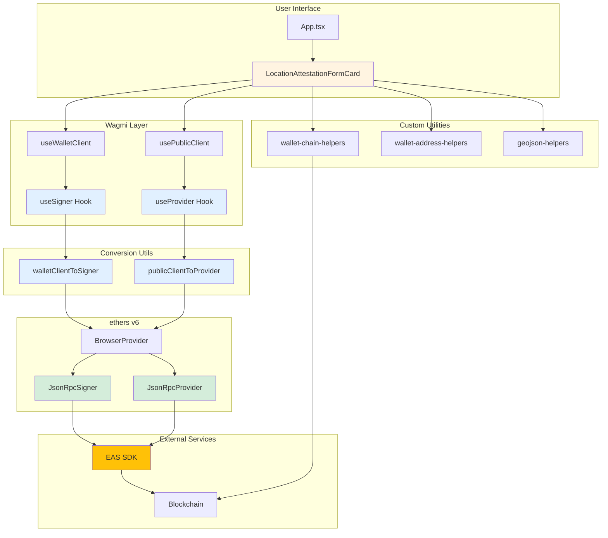
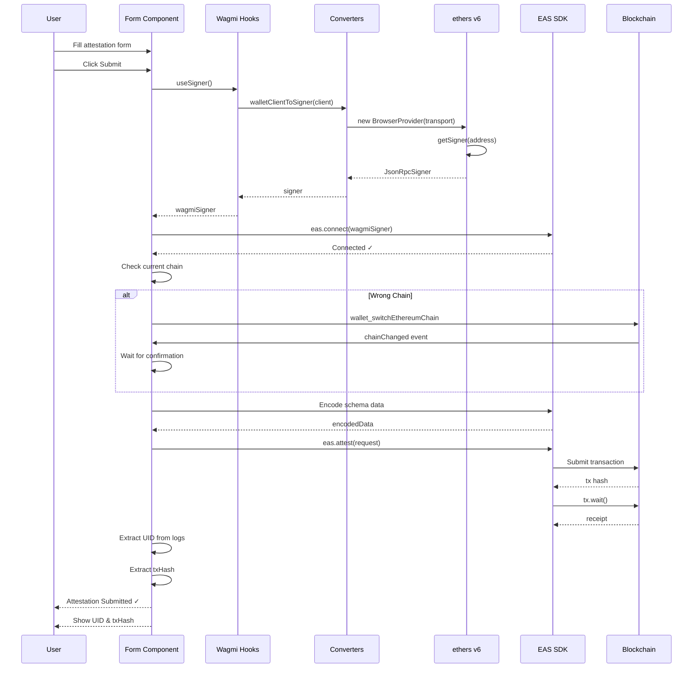
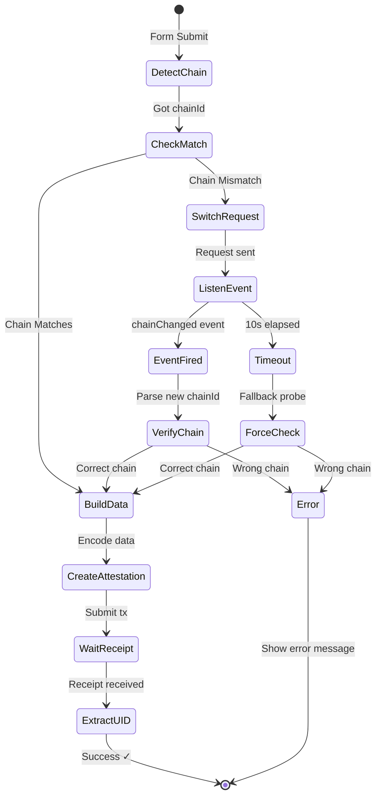
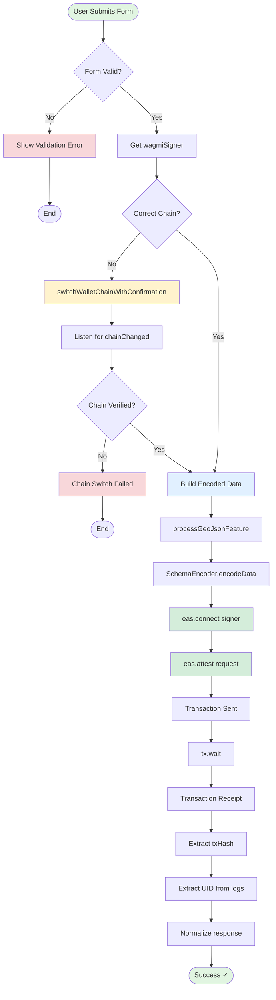
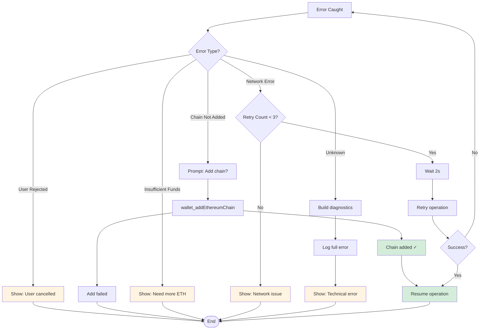

# Privy + EAS Signer Compatibility Flow

## Quick Reference: Signer Conversion

### The Problem

```typescript
// ❌ This doesn't work with EAS SDK
const provider = await privyWallet.getEthereumProvider();
const ethersProvider = new ethers.BrowserProvider(provider);
const signer = ethersProvider.getSigner();
```

### The Solution

```typescript
// ✅ Use Wagmi hooks + conversion utilities
const wagmiSigner = useSigner(); // Uses walletClientToSigner
const eas = new EAS(easContractAddress);
await eas.connect(wagmiSigner); // Works!
```

## Signer Creation Flow

```mermaid
  flowchart LR
    A[Privy Wallet] --> B[Wagmi Context]
    B --> C[useWalletClient Hook]
    C --> D[walletClient Data]
    D --> E[walletClientToSigner]
    E --> F[Extract Transport]
    F --> G[BrowserProvider]
    G --> H[getSigner]
    H --> I[JsonRpcSigner]
    I --> J[EAS.connect]
    J --> K[✓ Compatible!]
    
    style A fill:#fff4e1
    style B fill:#e1f0ff
    style E fill:#e1f0ff
    style I fill:#d4edda
    style K fill:#d4edda
```



## Component Architecture



## Attestation Submission Sequence



## Chain Switching with Event Confirmation



## Data Flow: Form Submit to Transaction Receipt



## Error Handling Strategy



---

**Note**: All diagrams can be rendered in any Markdown viewer that supports Mermaid syntax (GitHub, GitLab, VS Code with Mermaid extension, etc.)
