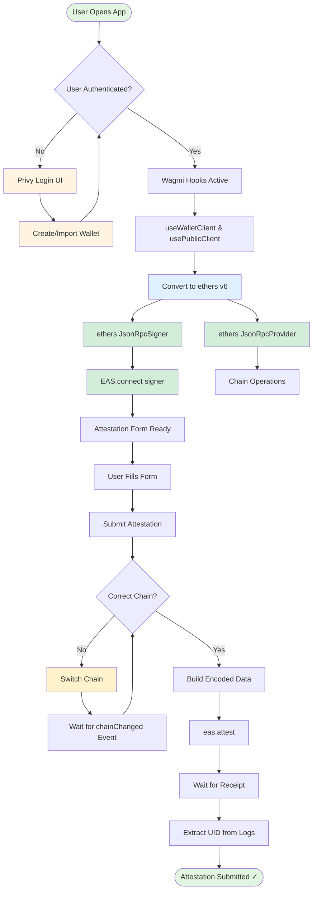
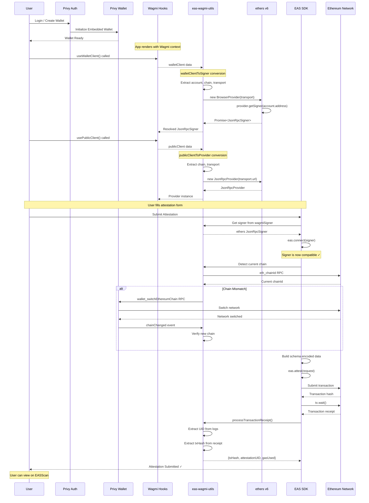

# Privy + EAS Integration Guide

## Overview

This document explains how to integrate Privy's embedded wallet functionality with the Ethereum Attestation Service (EAS) using ethers v6. The main challenge is making Privy's wallet signers compatible with EAS's signer requirements.

> This approach would not be possible without the following [gist](https://gist.github.com/slavik0329/2e5b6fc31cb745b65d3d37f7cf1d7b36), inspired by [discussions here](https://gist.github.com/slavik0329/2e5b6fc31cb745b65d3d37f7cf1d7b36).

## The Problem

Privy's embedded wallets provide a `getEthereumProvider()` method, but the resulting signer object is not directly compatible with EAS SDK's `connect()` method which expects an ethers-like signer.

### What Doesn't Work ❌

```typescript
// This approach fails with EAS
const provider = await wallet.getEthereumProvider();
const ethersProvider = new ethers.BrowserProvider(provider);
const signer = ethersProvider.getSigner(); // Returns Promise<JsonRpcSigner>

const eas = new EAS(easContractAddress);
await eas.connect(signer); // ❌ Type mismatch / compatibility issues
```

## The Solution

Use Wagmi's `useWalletClient` and `usePublicClient` hooks to create ethers v6 compatible signers and providers that work seamlessly with EAS.

### Architecture Overview



### Detailed Sequence Flow



## Implementation Details

### 1. Wagmi to ethers v6 Conversion

The key is in `eas-wagmi-utils.ts`:

```typescript
export async function walletClientToSigner(walletClient: any) {
  const { account, chain, transport } = walletClient;
  const network = {
    chainId: chain.id,
    name: chain.name,
    ensAddress: chain.contracts?.ensRegistry?.address,
  };
  const provider = new BrowserProvider(transport as any, network);
  const signer = await provider.getSigner(account.address);
  return signer;
}
```

**Why this works:**

- Wagmi's `walletClient` provides the raw transport layer
- We wrap it in ethers v6's `BrowserProvider`
- Call `getSigner()` with the account address to get a properly typed `JsonRpcSigner`
- This signer is fully compatible with EAS SDK

### 2. Using Custom Hooks

```typescript
// In your component
const wagmiSigner = useSigner();
const wagmiProvider = useProvider();

// These are now ethers v6 compatible
const eas = new EAS(easContractAddress);
await eas.connect(wagmiSigner); // ✅ Works perfectly
```

### 3. Multi-Wallet Support

The solution works with:

- ✅ Privy embedded wallets
- ✅ MetaMask (injected)
- ✅ Coinbase Wallet
- ✅ Rainbow Wallet
- ✅ WalletConnect

All wallet types are normalized through Wagmi's client abstraction.

### 4. Chain Switching

For chain switching, use the utility functions in `wallet-chain-helpers.ts`:

```typescript
import { switchWalletChainWithConfirmation } from '@/utils/wallet-chain-helpers';

const result = await switchWalletChainWithConfirmation(
  desiredChainId,
  wagmiSigner,
  wagmiProvider,
  wallet,
  {
    timeoutMs: 10000,
    onChainDetected: (chainId) => console.log('Switched to:', chainId)
  }
);

if (result.success) {
  // Chain switched successfully
  console.log('New chain:', result.newChainId);
}
```

### 5. Creating Attestations

```typescript
// 1. Connect EAS with compatible signer
const eas = new EAS(easContractAddress);
await eas.connect(wagmiSigner);

// 2. Encode your schema data
const schemaEncoder = new SchemaEncoder("string locationName,string coordinates");
const encodedData = schemaEncoder.encodeData([
  { name: "locationName", value: "Golden Gate Bridge", type: "string" },
  { name: "coordinates", value: "37.8199,-122.4783", type: "string" }
]);

// 3. Create attestation
const tx = await eas.attest({
  schema: schemaUID,
  data: {
    recipient: "0x0000000000000000000000000000000000000000",
    expirationTime: 0n,
    revocable: true,
    data: encodedData,
  },
});

// 4. Wait for transaction and extract UID
const receipt = await processTransactionReceipt(tx, eas, networkName, chainId);
console.log('Attestation UID:', receipt.attestationUID);
console.log('Transaction Hash:', receipt.txHash);
```

## Key Utilities

### wallet-chain-helpers.ts

Provides 11 utility functions for wallet/chain operations:

1. **parseChainId**: Parse chain IDs from various formats
2. **resolveProvider**: Get provider from wagmi or wallet
3. **detectChainId**: Detect current chain using multiple strategies
4. **resolveSigner**: Get signer with wallet matching
5. **switchWalletChain**: Basic chain switching
6. **waitForChainChangeEvent**: Event-driven chain detection
7. **verifyWalletChain**: Verify chain after switch
8. **processTransactionReceipt**: Extract UID and txHash
9. **buildErrorDiagnostics**: User-friendly error messages
10. **switchWalletChainWithConfirmation**: Complete chain switching with confirmation
11. **extractUidFromReceipt**: Parse UID from transaction logs

### wallet-address-helpers.ts

Provides address resolution for all wallet types:

1. **resolveWalletAddress**: Get address from embedded/linked/injected wallets
2. **getWindowEthereum**: Safe window.ethereum access

### geojson-helpers.ts

GeoJSON processing for location-based attestations:

1. **processGeoJsonFeature**: Handle Point/LineString/Polygon features

## Common Issues & Solutions

### Issue 1: Signer Type Mismatch

**Problem**: EAS SDK expects an ethers-like signer, but Privy's provider doesn't match.

**Solution**: Use Wagmi's `useWalletClient` → `walletClientToSigner` conversion.

### Issue 2: Chain Not Switching

**Problem**: Chain switch request sent but wallet doesn't actually change.

**Solution**: Use event-driven approach with `chainChanged` listener and timeout.

### Issue 3: Transaction Hash Not Captured

**Problem**: `txHash` shows as `null` or `unknown` in response.

**Solution**: Check multiple locations: `receipt.transactionHash`, `receipt.hash`, `tx.hash`, `attestationUID.transactionHash`.

### Issue 4: UID Not Found in Receipt

**Problem**: Attestation succeeds but UID is null.

**Solution**: Parse transaction logs for EAS event signatures, check `topics[1]` and data fields.

## Testing Checklist

- [ ] User can login with Privy
- [ ] Embedded wallet created successfully
- [ ] Wagmi hooks provide valid signer/provider
- [ ] EAS connects without errors
- [ ] Chain switching works on first click
- [ ] Attestation submits successfully
- [ ] Transaction hash captured correctly
- [ ] Attestation UID extracted from receipt
- [ ] Can view attestation on EASScan
- [ ] Works with MetaMask (injected wallet)
- [ ] Works with other wallet providers

## Resources

- [Using EAS SDK With viem/wagmi](https://docs.attest.org/docs/developer-tools/sdk-wagmi)
- [Privy Documentation](https://docs.privy.io/)
- [EAS SDK Documentation](https://docs.attest.sh/)
- [ethers v6 Documentation](https://docs.ethers.org/v6/)
- [Wagmi Documentation](https://wagmi.sh/)
- [EASScan Explorer](https://sepolia.easscan.org/)

## Example Application

See the `LocationAttestationFormCard` component for a complete implementation example demonstrating:

- Multi-wallet authentication
- Chain mismatch detection
- Automatic chain switching
- Schema encoding
- Transaction submission
- Receipt processing
- Error handling
- UX best practices

---
